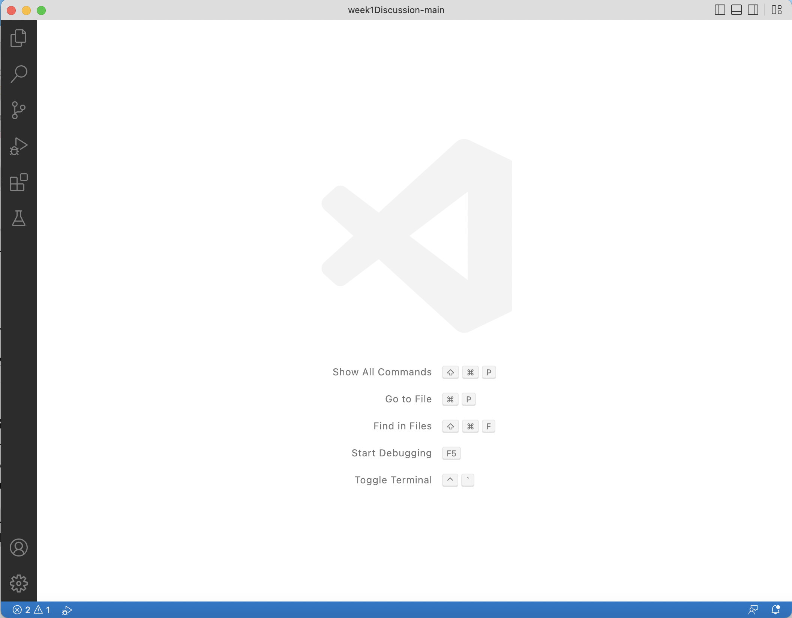
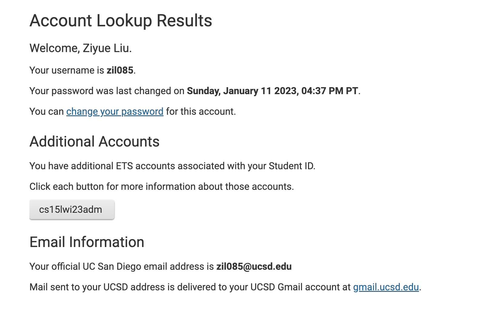
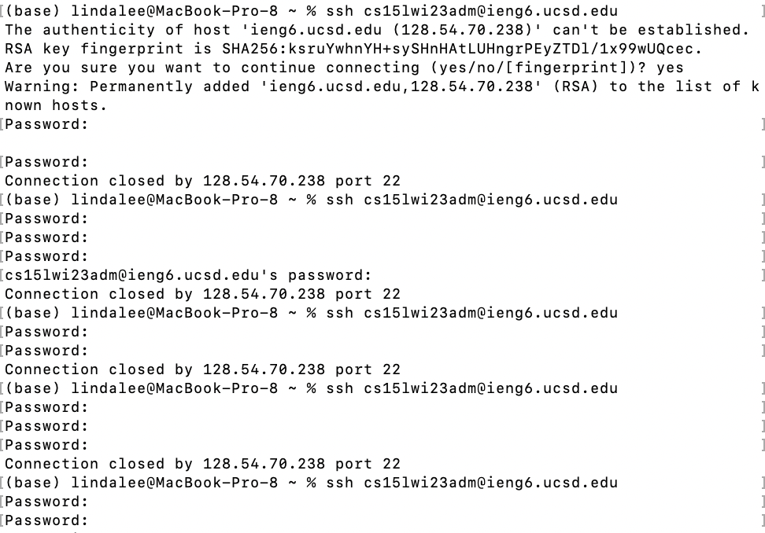
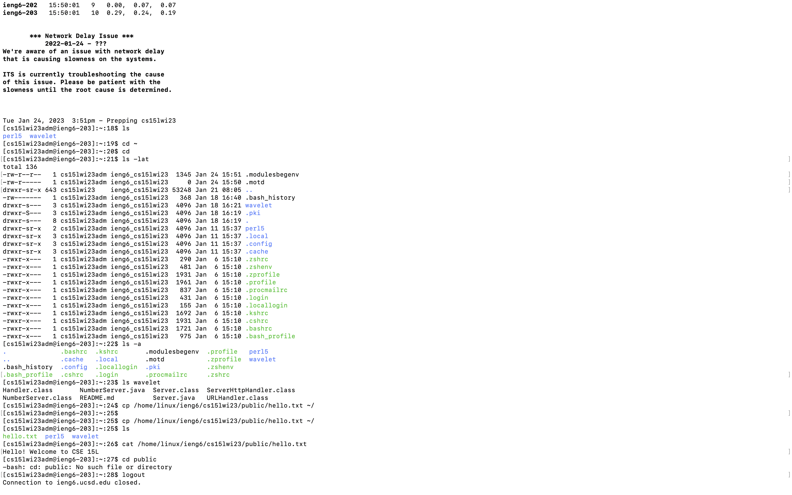
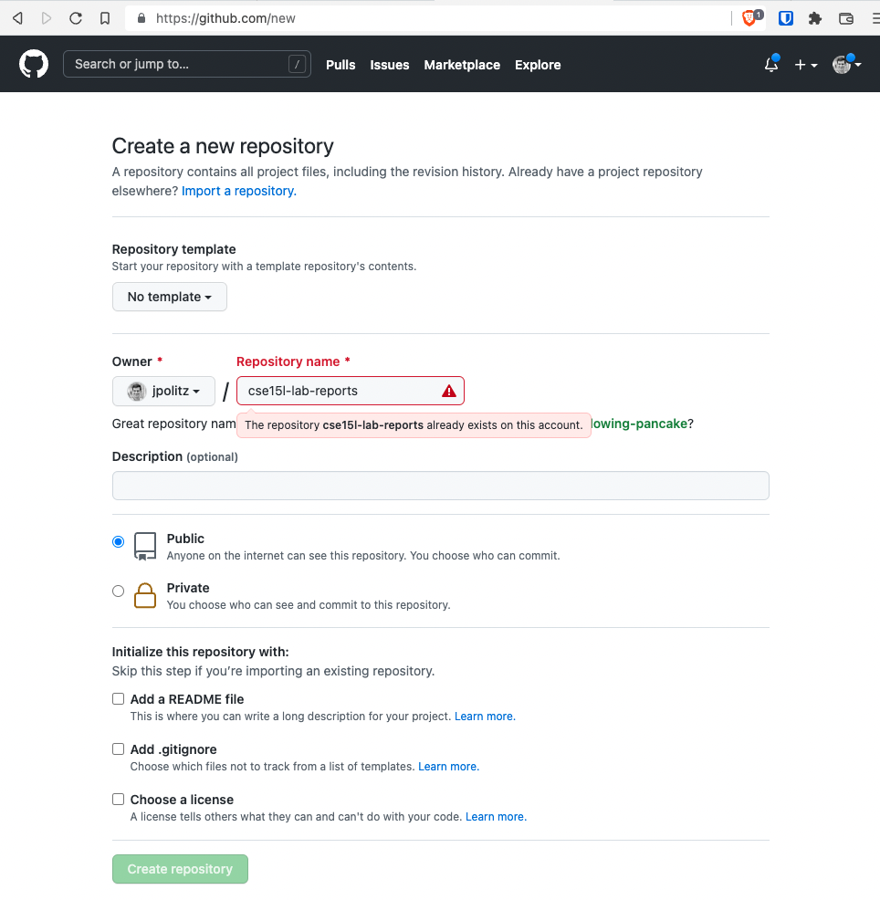
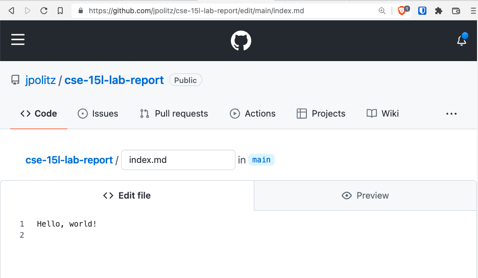
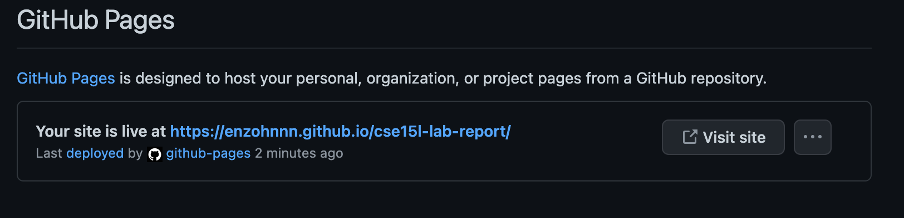

# Lab Report
---

## First part: Install VScode

* Visit [the Visual Studio Code website](https://code.visualstudio.com/)
* Follow the instructions to download and install it on your computer.

* After downloading and installing, open Visual Studio Code

---

## Second part: Remotely Connecting

* In the terminal, enter the command `ssh cs15lwi23adm@ieng6.ucsd.edu`.
Noting that each person has a unique account letter following "cs15lwi23", which can be found in [your specific course account](https://sdacs.ucsd.edu/~icc/index.php)

* When you connect to the remote computer via the terminal, it will prompt you with the message `Are you want to continue connecting (yes/no/[fingerprint])?`. Simply type `yes` and press enter.
* You will then be prompted to enter your password. Try using the password associated with your tritonlink account first. If the password is incorrect, you will need to reset it on the course-specific website mentioned earlier. Please note that it may take a few minutes for the password reset to take effect.

* If you're unable to login to the remote computer, don't worry, some people may be able to login on the first try, some people may need to try a few times.

*Once logged into my account on the classroom computer, we can enter various following commands in the terminal including
- `ls` to list the files and directories in the current directory
- `ls -lat` to display detailed information about all files
- `pwd` to display the current working directory
- `cp` to copy a file from a public directory to my personal account
---

## Third Step: git, Github, and Github Pages

* First, ensure that you have a GitHub account associated with your UCSD email, and sign in. If you do not have a GitHub account, please follow the instructions on the website to sign up.

* Next, create a new repository and name it "CSE15L-Lab_Reports", and add a brief description about the purpose of the repository.

* Then, within the repository, create a new file by clicking the "add files" button. Give the file a name, such as "index.MD", and write something into the file.
* Click “Commit new file” to save the work. You should see a view of your repository that now lists a file called index.md, and you can then copy the link from your browser and share it with your friends. 

* After that, go to the repository's settings by clicking the "Settings" button at the top of the page. From there, navigate to the "Page" option on the left sidebar.

* In the settings, ensure that the branch is set to "main" and that all other settings are left as they are. Remember to save these changes.
You should then receive a message that the source has been added. After a short wait, a link will become available, which you can use to visit your website.

