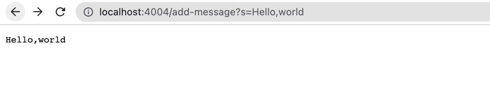
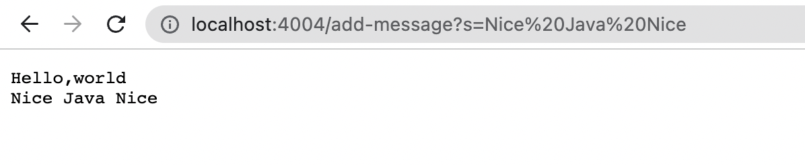
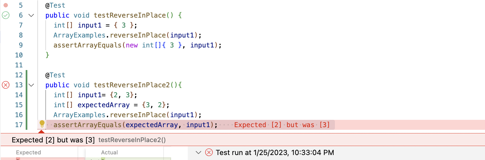

## First Part

```
import java.io.IOException;
import java.net.URI;
import java.util.ArrayList;
class Handler3 implements URLHandler {
    // The one bit of state on the server: a number that will be manipulated by
    // various requests.
    String result = "";
    public String handleRequest(URI url) {
        if (url.getPath().equals("/add-message")) {
            String[] parameters = url.getQuery().split("=");
            result=result+parameters[1]+"\n";
            return result;
        } 
        return "please write the path as /add-message?s=<String>";
    }
}

class StringServer {
    public static void main(String[] args) throws IOException {
        if(args.length == 0){
            System.out.println("Missing port number! Try any number between 1024 to 49151");
            return;
        }

        int port = Integer.parseInt(args[0]);

        Server.start(port, new Handler3());
    }
}
```

* The code in StringServer shows that every time the server is accessed, the method "handleRequest" in Handler3 will be invoked.
* It illustrates how the server functions when the path "/add-message?s=<string>" is entered, the server will print the previous message, along with the new message represented by <string> in the query.
  

* This is done by instantiating a global String variable called "result". Initially, the "result" is empty, but when the path "/add-message?s=Hello,world" is entered, the "result" is updated to include the new message "Hello,world/n". As a result, we can see the message "Hello,world" in the first picture. 


* Subsequently, when the path "/add-message?s=Nice Java Nice" is entered, "result" is updated to add "Nice Java Nice/n" to its existing content "Hello,world/n" resulting in "Hello,world/nNice Java Nice". As the result we see “Hello,world” <next line> “Nice Java Nice” in the second picture.

## Second Part

```
  	@Test 
	public void testReverseInPlace() {
    int[] input1 = { 3 };
    ArrayExamples.reverseInPlace(input1);
    assertArrayEquals(new int[]{ 3 }, input1);
	}

```
  
```
    @Test
  public void testReverseInPlace2(){
    int[] input1= {2, 3};
    int[] expectedArray = {3, 2};
    ArrayExamples.reverseInPlace(input1);
    assertArrayEquals(expectedArray, input1);
  }
```
  
* The JUnit test case ReverseInPlace() uses an input array containing only one element, 3. 
* The second test case, testRverseInPlace2(), uses an expanded array of {2,3} and the expected outcome is {3,2}. 
* However, the actual result is {3,3}. 
  


**Symptom**: After conducting additional tests, it appears that the symptom with the code is that it does not correctly reverse the order of elements in the array. Instead it assigns the value of the second half of the elements to the first half, without assigning the value of the first half to the second half.

```
  // Changes the input array to be in reversed order
  static void reverseInPlace(int[] arr) {
    for(int i = 0; i < arr.length; i += 1) {
      arr[i] = arr[arr.length - i - 1];
    }
  }
```
                                  
**Bug**: The bug was identified as a result of assigning the value of the second half of the elements to the first half without storing the value of the first half. This caused the first half elements to lose their value. When the loop iterated to the second half elements, it copied the same value that it had given to the first half elements, which explains why both the first and second half elements were assigned the value of the second half elements. 

```
    // Changes the input array to be in reversed order
  static void reverseInPlace(int[] arr) {
    for(int i = 0; i < arr.length/2; i += 1) {
      int temp = arr[i];
      arr[i] = arr[arr.length - i - 1];
      arr[arr.length-i-1]=temp;
    }
  }
```
**Solution**: The problem can be solved by storing the value of the first half elements in a temporary variable and assigning that value to the corresponding second half element. Another important consideration is the timing of the iteration, as the value exchange takes place at both ends, the loop only needs to stop at the middle of the array instead of the last element.

## Third Part
  
* Today, I learned about the proper way to check double values using JUnit. Unlike other values such as strings or integers, JUnit's method AssertEquals(double, double, double) takes three parameters, with the third parameter being used to address marginal error for point overflow errors. For example, assertEquals(1.00001, 1.00002, 0.001) will pass the test, even though mathematically 1.00001 does not equal 1.00002. However, the difference between the two values is less than 0.001, making it acceptable.

* Another thing I learned in today's lab is how to create two classes in the same file. When I was debugging the code for ListExample.java, I noticed that ListExample takes a class without declaring it explicitly, so I added a public class in the same file implementing the functions used in ListExample.java. However, it gave a compiler error, and it turns out that all classes declared as public class must have the same name as the file name. After I changed the public class to class, the code compiled and ran as expected.
  
