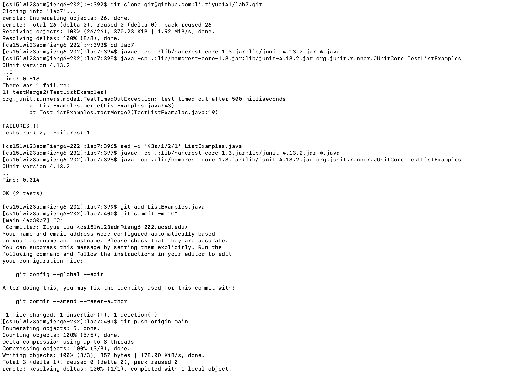

# lab 7
```
git clone git@github.com:liuziyue141/lab7.git
cd lab7
javac -cp .:lib/hamcrest-core-1.3.jar:lib/junit-4.13.2.jar *.java
java -cp .:lib/hamcrest-core-1.3.jar:lib/junit-4.13.2.jar org.junit.runner.JUnitCore TestListExamples
sed -i '43s/1/2/1' ListExamples.java
javac -cp .:lib/hamcrest-core-1.3.jar:lib/junit-4.13.2.jar *.java
java -cp .:lib/hamcrest-core-1.3.jar:lib/junit-4.13.2.jar org.junit.runner.JUnitCore TestListExamples
git add ListExamples.java
git commit -m “C”
git push origin main
```

* Our strategy for competing is straightforward but effective. We start by writing all the commands in their complete form on an editor file. 
* Beginning with "git clone" to download an unmodified forked lab7 directory containing a faulty "ListExamples.java" file that needs to be modified. 
* The second and third commands compile and run the Java code, demonstrating that the current program cannot pass all the testers. 
* The fourth command is a special one that allows the terminal to correct the "ListExamples.java" file directly, without the need for any manual editing tools. Using "43s/1/2/1," we replace only the first occurrence of "1" with "2" on line 43, which should theoretically fix the bug.
* The fifth and sixth commands prove that our solution has indeed corrected the bug. Finally, we use "git add," "git commit," and "git push" to upload our changes to the online repository.
* Our secret to avoiding any shortcut methodologies is after SSH'ing into the remote computer, we copy all the commands to the terminal in the beginning using "Ctrl+C." The terminal will then run all the commands sequentially and automatically, allowing us to avoid any shortcuts while still completing the task efficiently.

**here is a snapshot of our results**

